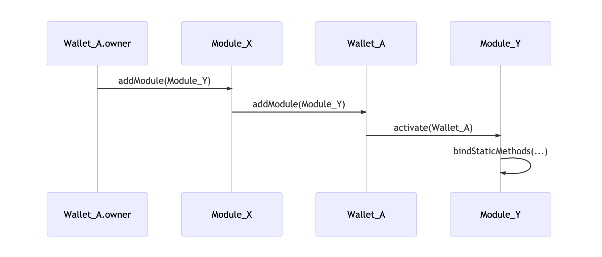

# DESIGN DOC

## 钱包和模块

钱包设计的一个目标就是在功能上具有可扩展性，这样将来添加新的功能或者升级已有的功能就无需重新部署新版本。目前的设计主要围绕着两个核心概念。

### Wallet

Wallet 是我们智能钱包的基础合约，用来真正存储用户的资产。

每个 Wallet 必须有一个 owner，这个 owner 可以是以太坊的外部地址（Externally Owned Account，简称 EOA)，也可以是任意的支持 EIP1271 的合约地址。由于 Wallet 本身已经支持了 EIP1271，因此一个 Wallet 的 owner 甚至可以是另外一个 Wallet。Wallet 在设置新的 owner 的时候不会减产新的 owner 是否真的支持 EIP1271，原因是即使设置错误，也可以通过守护人重置 owner。这个后面会讲到。

Wallet 提供的方法几乎都是和 Module 相关，钱包的几乎所有功能都是通过不同的 Module 实现的。当钱包被创建的时候，除了必须制定 owner 地址外，还必须提供一个默认的 Module 列表，原因是后续添加和移除 Module，必须通过调用`Wallet.addModule`方法来实现，而这个方法要求它的 msg.sender 必须是一个现有的 Module。这也意味着一个钱包的 Module 列表不能为空，否则就无法添加更多的 Module 了。

### Module

钱包的功能按照 Module 做切割，每个 module 相对都比较小巧，保障维护成本较低。每个钱包在生成后，会自动绑定一些默认的 Module，后续钱包可以发交易增加新的或者去掉已有的 Module，但每个 Module 必须是预注册的，也就意味着 Module 必须由我们来批准，不能是任意合约。

### 添加和删除 Module

下面是钱包添加新 Module Y 的流程。



如果 Wallt_A 的 owner 自身没有以太来发起交易，那么就可以通过元交易完成（参考后续章节）。

下面钱包是移除 Module Y 的流程。


### 钱包通过 Module 读信息

每个 Module 可以提供两类不同的方法，**读方法**和**写方法**。读方法可以通过 Wallet 的`bindStaticMethod`绑定到钱包。每个 Module 都会提供一个`staticMethods`方法，来告诉钱包它提供哪些读方法。当 Module 被加到一个钱包时候，所有的读方法就会自动被绑定到该钱包；当 module 被从一个钱包移除时，绑定的读方法就会被`unbindStaticMethod`解绑。

假设`getSomething`这个只读方法在 Module A 当中并且被绑定到了某个钱包，那么当这个钱包被调用`getSomething`的时候，这个调用就会自动被转给 Module A。


通过这种静态绑定，我们可以为钱包添加更多的读方法。值得注意的是，不同的 Module 的读方法如果要绑定到 Wallet，必须保证方法名称的全局唯一性，否则绑定就会失败，钱包就无法创建成功。

### 钱包通过 Module 写信息（做转账）

写方法就不能绑定了。我们假设 Wallet_A 想调用某个第三方合约 SomeContract 的 transfer 方法，那么 Wallet_A 的 owner 可以找一个支持这种任意调用的 Module_A，通过它提供的 doSomething 方法来完成操作。注意这个 doSometing 名字并不重要，和 transfer 也没什么关系。

首先需要构造一个 bytes data,来表示调用目标合约 SomeContract 中的方法名字和参数，以及需要发的以太数量。然后把 data 通过 doSomething 方法调用传给 Module_A，ModuleA 会验证 msg.sender 是 Wallet_A 的 owner，在调用 Wallet_A 的 transact 方法。而这个 transact 方法是 Wallet 最核心的方法，它可以以 wallet 作为 msg.sender 来调用任意合约的任意方法（通过 call.value()()）。


### 元交易

上面的几个示例都是钱包的 owner 作为 msg.sender 发起交易。但实际上我们是尽量避免钱包的 owner 本身有 Ether 的 - 否则 Wallet 和 Owner 都有 Ether 就比较奇怪。也就是说，绝大多数用户都不会用 owner 来发起交易。

我们设计的思路是 100%的交易都是通过元交易来实现。也就是说，钱包的 owner 生成元交易，并附带合适的签名（见下面章节）。然后把这些数据链外发给一个愿意帮忙做转账的一个 relayer（这里的中继和我们交易所的中继不是一个概念）。这个 relayer 调用目标 Module 的`executeMetaTx`方法来发起交易。元交易的 msg.sender 是 relayer，因此 relayer 支付 Ether 做油费；但在调用最后，Wallet 会支付特定的 gasToken 给 relayer 做费用支付。当然，这个 gasToken 也可以是 0x0，代表以太。如果 gasPrice 是 0，代表 Wallat 不想支付任何费用，这时候 relayer 可以决定是不是要帮助执行这个元交易。

```solidity
function executeMetaTx(
    bytes   calldata data, // 元交易数据
    uint    nonce,
    uint    gasPrice,
    uint    gasLimit,
    address gasToken,
    bytes   calldata signatures // 签名
    )
    external
    payable;
```

元交易的本质是把 msg.sender 换成任何一个愿意帮忙发起交易的账号（这个账号最可能是我们自己的一个账号）。然后 relayer 付以太油费，Wallet 付给 relayer 以太或者 ERC20 费用。

元交易中 gasPrice 和 gasLimit 和以太坊原生的概念十分类似，只不过有两点细节不同：第一是 gasPrice 是用 gasToken 为单位计费的，第二是 gasLimit

### 验签


### 安全

### 守护人

### 钱包锁定

### 限额与交易批准

### 基于时间锁的继承

## dapp 集成

### 借贷获息

- Compound
- BZX
- DyDX
- MakerDAO DSR
- Topo finance
- Meta Money Market

### 交易

- Loopring
- Uinswap

### 博彩

- PoolTogether

## 几个和钱包相关的重要 EIPs

- [EIP:681: URL Format for Transaction Requests](https://github.com/ethereum/EIPs/blob/master/EIPS/eip-681.md)
- [EIP725 : Ethereum Identity Standard](https://docs.ethhub.io/built-on-ethereum/identity/ERC725/)
- [EIP1077: Executable Signed Messages refunded by the contract](https://github.com/ethereum/EIPs/blob/master/EIPS/eip-1077.md)
- [EIP1078: Universal login / signup using ENS subdomains](https://github.com/alexvandesande/EIPs/blob/ee2347027e94b93708939f2e448447d030ca2d76/EIPS/eip-1078.md)
- [EIP1271: Standard Signature Validation Method for Contracts](https://eips.ethereum.org/EIPS/eip-1271)
